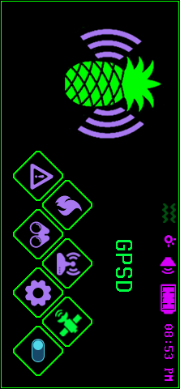
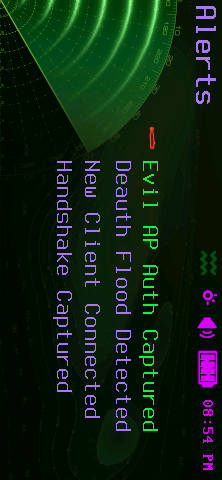
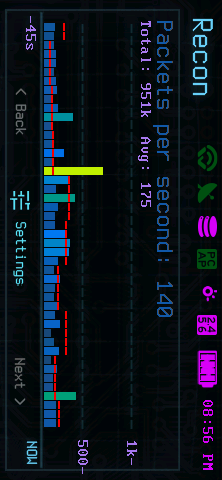
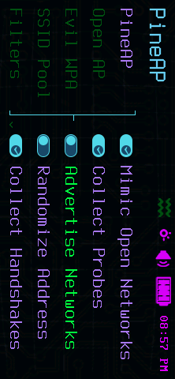
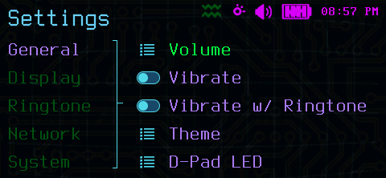
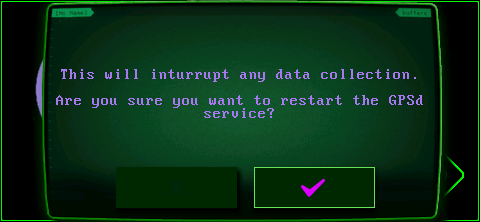
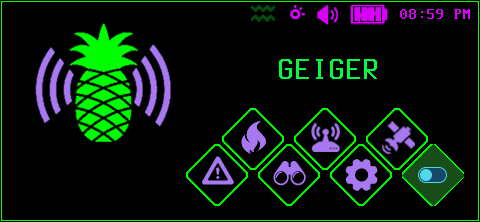

# Purple Pineapple Theme

A custom purple/green theme for the Hak5 WiFi Pineapple Pager.

## Features

- Purple color scheme with green highlights when selected
- 7-button dashboard layout with zigzag pattern
- Custom icons for all dashboard buttons
- GPSD restart button for quick GPS daemon restart
- GEIGER toggle for recon audio
- Dark green toggle background when highlighted

## Dashboard Buttons

| Button | Function |
|--------|----------|
| ALERTS | View alerts |
| PAYLOADS | Access payloads |
| RECON | Reconnaissance tools |
| PINEAP | PineAP settings |
| SETTINGS | Device settings |
| GPSD | Restart GPS daemon |
| GEIGER | Toggle recon audio |

## Screenshots

### Boot Screen

### Dashboard

### Alerts

### Payloads

### Recon

### PineAP

### Settings

### GPSD Restart

### GEIGER Toggle

## Customization

- Edit `theme.json` for color palette
- Edit `components/dashboards/wargames_dashboard.json` for button layout
- Icons are in `assets/dashboard/`

## Author

brAinphreAk
